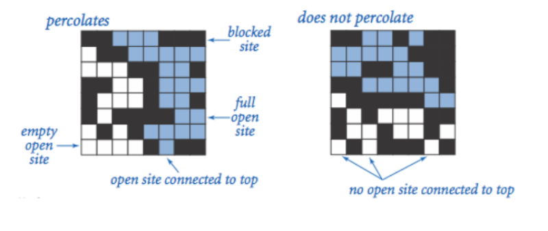
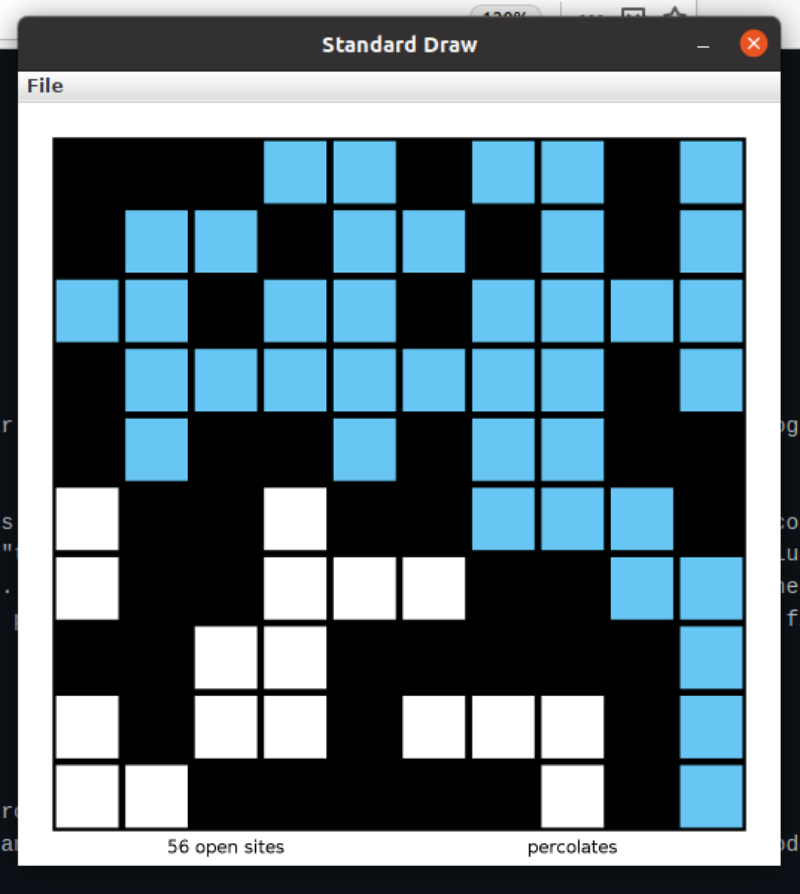

# Percolation
## Technologies and Libraries
<ul> 
<li> openjdk version 11.0.11 </li>
<li> Intellij Idea</li>
<li> algs4.jar </li>
<li> stdlib.jar </li>
</ul>

## How to Run the code
In order to run this code you need to make sure that the algs4.jar and the stdlib.jar files are in the your java classpath. You can follow a tutorial on how to 
do this if you click on these links depending on your operating system.

<ul> 
<li>Linux : https://lift.cs.princeton.edu/java/linux/ </li>
<li>Windows : https://lift.cs.princeton.edu/java/windows/</li>
<li>Mac : Mac : https://lift.cs.princeton.edu/java/mac/ </li>
</ul>

Once these are in your classpath you can clone the repository with the following command

```
git clone https://github.com/PaulCardoos/Percolation.git
```

After you have successfully downloaded the repo and made sure your classpath includes stdlib.jar and algs4.jar, you can run the code like any other java program.

<b>Example commands to run code</b><br><br>
ArrayPercolation.java 
```
java ArrayPercolation data/input10.txt
```
UFPercolation.java 
```
java ArrayPercolation data/input10.txt
```
PercolationStats.java
```
java PercolationStats.java 100 1000
```

## Description
This code is a project from my algorithms class at the University of Massachusetts Boston. It is interesting so I decided to redo it and make it clean. Percolation
In physics, chemistry and materials science, percolation (from Latin percolare, "to filter" or "trickle through") refers to the movement and filtering of fluids through
porous materials. It is described by Darcy's law. (-wiki) We can think of this code in this way. In computer science terms, if there is a clear path from the top 
row to the bottom row the system percolates, if not the system does not percolate. Consider the porous material example, where we have a system where water flows from the
top down. If water can flow from the top row to the bottom row the system percolates




<b>ArrayPercolation</b> implements the Percolation interface and uses a 2d array and a depth first search to determine wether or not the system percolates. 
<b>UFPercolation</b> implements the Percolation interface as well and uses a WeightQuickUnionUF (you can find this class <a href="https://algs4.cs.princeton.edu/code/edu/princeton/cs/algs4/WeightedQuickUnionUF.java.html">here</a>) 
object as the underlying data structure.

<b>Percolation Stats</b> is an estimation of the percolation threshold using a monte carlo simulation. The code makes a UFPercolation object and picks a random row and col
in between 1 to n and fills cells until the UFPercolation object percolates. We go on to repeat this experiment m time while recording the percolation threshold each time.
At the end of the experiment to code display the mean, standard deviation, high confidence, and low confidence.

## Visualizer

The Percolation visualizer allows you to visualize the running of your code. 

The following is an example visualization of ArrayPercolation.java



you can reproduce the above visualization by running the following command, make sure you are in the correct directory and run 

```
java PercolationVisualizer array data/input10.txt
```
you can swap out "array" with "UF" to view the union finder visualizer and you can use and input10 file in the data section.


